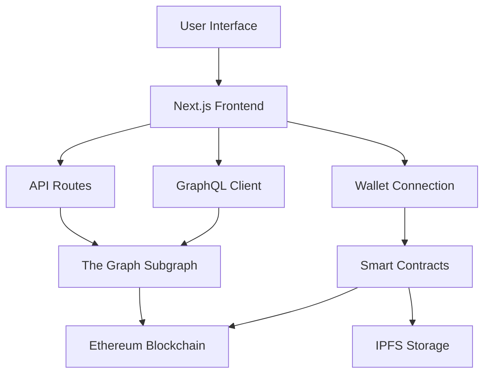

# GalleryFi - Curated NFT Marketplace

> **Think Shopify for digital art.** GalleryFi is where quality meets blockchain technology. We built this because the NFT space needed a platform that actually cares about the art, not just the hype.

## 🎬 Video Demo

[](https://youtu.be/ZvzXC-PFaew)

**See the full project in action** - Complete walkthrough of minting, trading, and auction features.


## Screenshots

<div align="center">

### Explore Marketplace


### Create NFT


### NFT Detail Page


</div>

</div>

## What is GalleryFi?

**GalleryFi** started as a simple idea: what if NFT marketplaces actually focused on quality instead of quantity? We got tired of scrolling through endless low-effort collections and decided to build something different.

It's basically a digital art gallery that runs on the blockchain. Artists apply to join, we curate what gets in, and collectors know they're buying something special. No more sifting through thousands of random generated avatars to find actual art.

### Here's what makes us different:
- **We actually curate**: Not everyone can just upload whatever they want
- **Artists get paid forever**: Smart contracts automatically send royalties on every resale
- **No rug pulls**: Everything is on-chain and transparent
- **It actually works fast**: We spent months optimizing so it doesn't feel like most dApps

### If you're not into crypto yet:
Think of it like Etsy, but for digital art that you actually own. When you buy something, you get a certificate of authenticity that nobody can fake or take away. The artist gets paid, you get unique art, and if it becomes popular later, you can sell it and the original artist still gets a cut.

---

## Key Features

### For Collectors
- **Buy instantly** or **bid in auctions**: Some pieces have fixed prices, others go to the highest bidder
- **Mobile-friendly**: Works great on your phone (trust me, we tested this extensively)
- **Live auction updates**: Watch bids roll in real-time without refreshing
- **Smart filtering**: Toggle between "show me everything" and "show me what I can actually buy"
- **Favorites**: Save pieces you love for later
- **Clear ownership**: Never confused about who owns what vs. who's selling

### For Artists
- **Lifetime royalties**: Get paid every single time your work resells (we use the EIP-2981 standard)
- **Secure payments**: Money goes into escrow until everything's confirmed
- **No technical headaches**: We handle all the blockchain complexity
- **Quality audience**: Collectors who actually care about art, not just flipping

### Under the Hood (For Developers)
- **Rock-solid security**: We use battle-tested patterns like ReentrancyGuard and pull payments
- **ERC-721 compatible**: Works with every wallet and marketplace
- **Emergency controls**: Can pause if something goes wrong (safety first)
- **Gas optimized**: Transactions cost less than you'd expect
- **Thoroughly tested**: 46 test cases covering everything we could think of


## How It All Works Together



**How it works:**
1. **User Interface**: You click "Buy NFT" or place a bid
2. **Wallet Connection**: Your crypto wallet (like MetaMask) confirms the transaction
3. **Smart Contracts**: The blockchain verifies and executes the purchase/bid
4. **Data Indexing**: The Graph indexes all blockchain events for fast querying
5. **Frontend Updates**: The UI immediately shows your new NFT or updated bid status

### The Smart Contracts

**MyNFT.sol** - This is the actual NFT collection
- Mints new NFTs (only owner can do this - that's the curation part)
- Handles royalties automatically (5% to creator by default)
- Stores metadata on IPFS

**NftMarketplace.sol** - This handles all the buying/selling
- Fixed price listings (buy it now)
- Auction system (highest bidder wins)
- Takes 2.5% platform fee
- Automatically pays royalties to original creators
- Uses "pull payments" so no one can hack the money flow

## Tech Stack

**Smart Contracts:** Solidity 0.8.28, Hardhat, OpenZeppelin  
**Frontend:** Next.js 15, React 19, TypeScript, Tailwind CSS  
**Web3:** Wagmi, Viem, RainbowKit  
**Data:** The Graph Protocol, GraphQL  
**Storage:** IPFS, Pinata

---

## Smart Contract Details

### MyNFT.sol - Collection Contract
```solidity
// Key Features:
✅ ERC-721 compliant with URI storage
✅ EIP-2981 implementation for royalties
✅ Ownable access control
✅ 5% default royalties to creator
✅ Customizable royalties per token
✅ Configurable base URI
✅ Storage gap for upgradeability
```

**Key Functions:**
- `mint(address to, string uri)` - Owner-only minting
- `mintWithRoyalty()` - Minting with custom royalties
- `setDefaultRoyalty()` - Global royalty configuration

### NftMarketplace.sol - The Marketplace Engine
```solidity
// Key Features:
✅ Fixed-price listings
✅ English auction system
✅ 2.5% platform fee
✅ Automatic royalty distribution
✅ Pull payments pattern for security
✅ Emergency pause functionality
✅ NFT rescue capability for emergencies
```

**Core Functions:**
- `listItem()` - Create fixed-price listing
- `buyItem()` - Instant purchase
- `createAuction()` - Start auction
- `placeBid()` - Place bid
- `endAuction()` - End auction
- `withdrawProceeds()` - Withdraw earnings

---

## How to Get This Running on Your Machine

Let's be honest - setting up a Web3 project can be frustrating. I've tried to make this as painless as possible, but you'll still need to get a few services set up. I'll walk you through everything.

### What You'll Need First

Make sure you have these installed:
```bash
# Check if you have these (run these commands):
node --version    # Should be 18.0.0 or higher
npm --version     # Should be 9.0.0 or higher
git --version     # Any recent version is fine

# If you don't have them:
# 1. Install Node.js from nodejs.org (get the LTS version)
# 2. npm comes with Node.js automatically
# 3. Git from git-scm.com
```

You'll also want MetaMask or another Web3 wallet installed in your browser.

### Step 1: Get the Code and Install Dependencies

```bash
# Get the code
git clone https://github.com/EnricCoding/GalleryFi.git
cd GalleryFi

# Install everything (this takes a minute or two)
npm install
```

### Step 2: Set Up External Services

Before we can run anything, you need accounts with a few services. Don't worry, they're all free for development:

#### Alchemy (For talking to the blockchain)
1. Go to [alchemy.com](https://alchemy.com) and sign up
2. Create a new app, choose "Ethereum" and "Sepolia" (testnet)
3. Copy the API URL - you'll need it in a minute

#### WalletConnect (For connecting wallets)
1. Head to [walletconnect.com](https://walletconnect.com) and create account
2. Create a new project
3. Copy the Project ID

#### Pinata (For storing NFT images and metadata)
1. Sign up at [pinata.cloud](https://pinata.cloud)
2. Go to API Keys and create a new key
3. Choose "Admin" permissions (we need upload and delete)
4. Save the JWT, API Key, and Secret somewhere safe
5. In your dashboard, go to Gateways and note your gateway URL

#### The Graph (For indexing blockchain data)
1. Go to [thegraph.com/studio](https://thegraph.com/studio)
2. Connect your wallet and create a new subgraph
3. We'll deploy to this later, but grab the URL for now

### Step 3: Configure Your Environment Files

This is where most people get stuck, so I'll show you exactly what goes where.

#### Frontend Configuration
Create `packages/frontend/.env.local` with these values:

```bash
# Blockchain connection
NEXT_PUBLIC_SEPOLIA_RPC=https://eth-sepolia.g.alchemy.com/v2/YOUR_ALCHEMY_KEY_HERE
NEXT_PUBLIC_CHAIN_ID=11155111

# Smart contract addresses (we'll deploy these in step 5)
NEXT_PUBLIC_NFT_ADDRESS=0xfd6580707778bE0d6Fc1447Ff42237e29a7cb047
NEXT_PUBLIC_MARKET_ADDRESS=0x5e3ef51F0a662dF65dea3e115C689E0cDE2A0F37

# Data indexing
NEXT_PUBLIC_SUBGRAPH_URL=https://api.studio.thegraph.com/query/YOUR_SUBGRAPH_ID/gallery-fi/v0.0.1

# Wallet connections
NEXT_PUBLIC_WC_PROJECT_ID=YOUR_WALLETCONNECT_PROJECT_ID

# IPFS storage
NEXT_PUBLIC_PINATA_GATEWAY=your-gateway-name.mypinata.cloud
PINATA_JWT=your_pinata_jwt_here
PINATA_API_KEY=your_pinata_api_key
PINATA_API_SECRET=your_pinata_secret
PINATA_GATEWAY=your-gateway-name.mypinata.cloud
```

#### Smart Contract Configuration
Create `packages/contracts/.env` with these values:

```bash
# Your wallet private key (NEVER share this!)
# Get it from MetaMask: Settings > Advanced > Export Private Key
PRIVATE_KEY=your_private_key_here

# Same Alchemy URL as before
SEPOLIA_RPC=https://eth-sepolia.g.alchemy.com/v2/YOUR_ALCHEMY_KEY_HERE

# For contract verification (optional but recommended)
# Get free API key from etherscan.io
ETHERSCAN_API_KEY=your_etherscan_api_key

# For gas cost reporting (optional)
COINMARKETCAP_API_KEY=your_coinmarketcap_key
REPORT_GAS=true
```

**Security note**: Never commit these .env files to git. They're already in .gitignore, but double-check!

### Step 4: Get Some Test ETH

You'll need Sepolia testnet ETH to deploy contracts and test the app:

1. Add Sepolia network to MetaMask:
   - Network Name: `Sepolia`
   - RPC URL: `https://sepolia.infura.io/v3/` (or use your Alchemy URL)
   - Chain ID: `11155111`
   - Currency: `ETH`

2. Get free test ETH from a faucet:
   - [Google Cloud Web3 Faucet](https://cloud.google.com/application/web3/faucet/ethereum/sepolia) (Recommended - most reliable)
   - [Alchemy Sepolia Faucet](https://sepoliafaucet.com/)
   - [Chainlink Faucet](https://faucets.chain.link/)
   - You'll need about 0.1 ETH to deploy and test
   
   **Pro tip**: The Google Cloud faucet gives you 0.05 ETH per day and rarely runs out, unlike the others that sometimes go offline.

### Step 5: Deploy the Smart Contracts

```bash
# Go to the contracts folder
cd packages/contracts

# Compile the contracts (make sure everything builds)
npm run compile

# Run tests to make sure everything works
npm run test

# Deploy to Sepolia testnet
npm run deploy:sepolia

# Verify contracts on Etherscan (optional but cool)
npm run verify:sepolia
```

After deployment, you'll see the contract addresses in the terminal. Copy these and update your frontend `.env.local` file with the real addresses.

### Step 6: Set Up The Graph Subgraph

The Graph indexes all the blockchain events so we can query them quickly:

```bash
# Go to the subgraph folder
cd packages/subgraph

# Install Graph CLI globally if you haven't
npm install -g @graphprotocol/graph-cli

# Authenticate with The Graph
graph auth --studio YOUR_DEPLOY_KEY

# Generate code from the schema
npm run codegen

# Build the subgraph
npm run build

# Deploy to Graph Studio
npm run deploy
```

Update your frontend `.env.local` with the new subgraph URL.

### Step 7: Start the Frontend

```bash
# Go to the frontend folder
cd packages/frontend

# Start the development server
npm run dev
```

Open [http://localhost:3000](http://localhost:3000) and you should see GalleryFi running!

### Step 8: Test Everything Works

1. **Connect your wallet**: Click the connect button and approve MetaMask
2. **Create an NFT**: Go to /create and upload an image (this tests Pinata integration)
3. **List it for sale**: Set a price and create a listing (this tests the marketplace contract)
4. **Try buying it**: Use a different wallet address to test the purchase flow

### Common Issues and Fixes

**"Transaction failed"** - Make sure you have enough Sepolia ETH and the contracts are deployed

**"Subgraph not found"** - The Graph takes 5-10 minutes to sync after deployment

**"IPFS upload failed"** - Double-check your Pinata credentials and make sure you have upload permissions

**"RPC error"** - Your Alchemy quota might be exceeded (free tier is 300M requests/month)

**TypeScript errors** - Run `npm run codegen` in the contracts folder to regenerate types

### What's Next?

Once you have everything running locally:
- Deploy to mainnet by changing the chain ID and using mainnet RPC URLs
- Deploy the frontend to Vercel or Netlify
- Set up monitoring for the subgraph
- Add your own artists and start curating!

---

## Making Sure Everything Works

### Testing the Smart Contracts
I wrote a bunch of tests to make sure the contracts don't break when people try weird stuff:

```bash
cd packages/contracts

# Run all the tests (takes about 30 seconds)
npm run test

# See how much gas each function uses
npm run gas

# Check test coverage
npm run coverage
```

You should see something like:
```
✓ NFT Contract Tests (15 tests passed)
✓ Marketplace Tests (23 tests passed) 
✓ Integration Tests (8 tests passed)
```

If any tests fail, something's wrong with your setup.

### Testing the Frontend

```bash
cd packages/frontend

# Test the React components
npm run test

# Run tests and re-run when files change
npm run test:watch
```

### Keeping the Code Clean

```bash
# Fix formatting issues automatically
npm run lint:fix

# Just check for problems without fixing
npm run lint
```

---

## Going Live (Production Deployment)

### Deploying the Frontend

**Vercel (Easiest option):**
```bash
# Install Vercel CLI
npm i -g vercel

# Deploy with one command
vercel --prod
```

**Netlify (Also easy):**
Just connect your GitHub repo in the Netlify dashboard and it deploys automatically on every push.

### Moving to Mainnet

When you're ready for real money:

1. Change your `.env.local` file:
```bash
NEXT_PUBLIC_CHAIN_ID=1
NEXT_PUBLIC_SEPOLIA_RPC=https://eth-mainnet.g.alchemy.com/v2/YOUR_KEY
```

2. Deploy contracts to mainnet:
```bash
npm run deploy:mainnet
```

**Warning**: Mainnet costs real money! Each deployment costs around $50-100 in gas fees.

## Key Details

**Business Model:** Curated marketplace (2.5% platform fee, 5% artist royalties)  
**Security:** ReentrancyGuard, pull payments, emergency pause, 46 test cases  
**License:** MIT
- **Pull payment pattern** to prevent force attacks
- **Pausable contracts** for emergency situations
- **Access controls** with specific roles
- **Input validation** on all parameters
- **Gas optimizations** to prevent DoS attacks

### Frontend Security
- **Complete type safety** with TypeScript
- **Input sanitization** on all forms
- **CSRF protection** on API routes
- **Rate limiting** on critical endpoints
- **Error boundaries** for graceful error handling
- **Wallet security** with signature validations

### Infrastructure Security
- **Environment variables** for sensitive data
- **Automatic API key rotation**
- **HTTPS enforcement** in production
- **Content Security Policy** headers
- **Automatic dependency scanning**

## Who Built This

**Enric** - Full Stack Blockchain Developer

I built GalleryFi because I believe NFTs can be more than just profile pictures and get-rich-quick schemes. There's real potential for digital art when you focus on quality and sustainability.

- **GitHub**: [@EnricCoding](https://github.com/EnricCoding)
- **Email**: enricpaginasweb@gmail.com

---

<div align="center">

**[Check out the live demo](https://galleryfi.vercel.app)** | **[Found a bug? Let me know](https://github.com/EnricCoding/GalleryFi/issues)**

⭐ If this project helped you learn something, consider giving it a star!

</div>