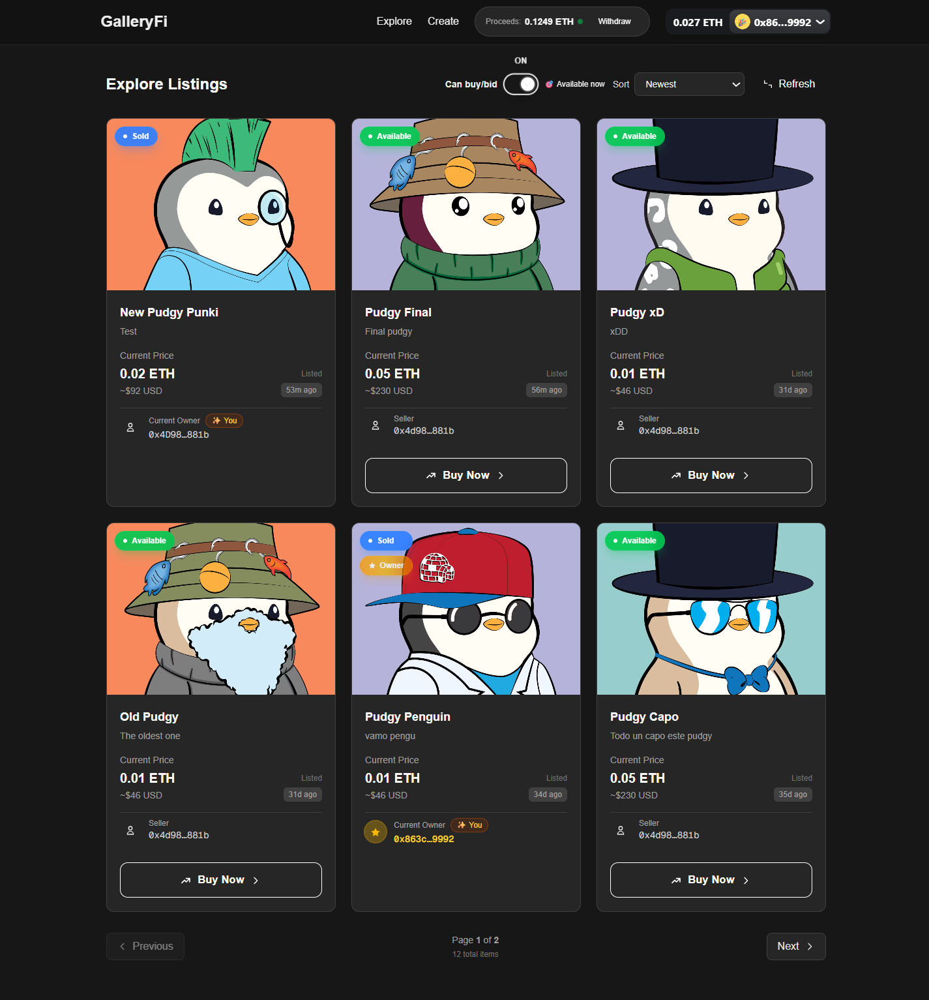
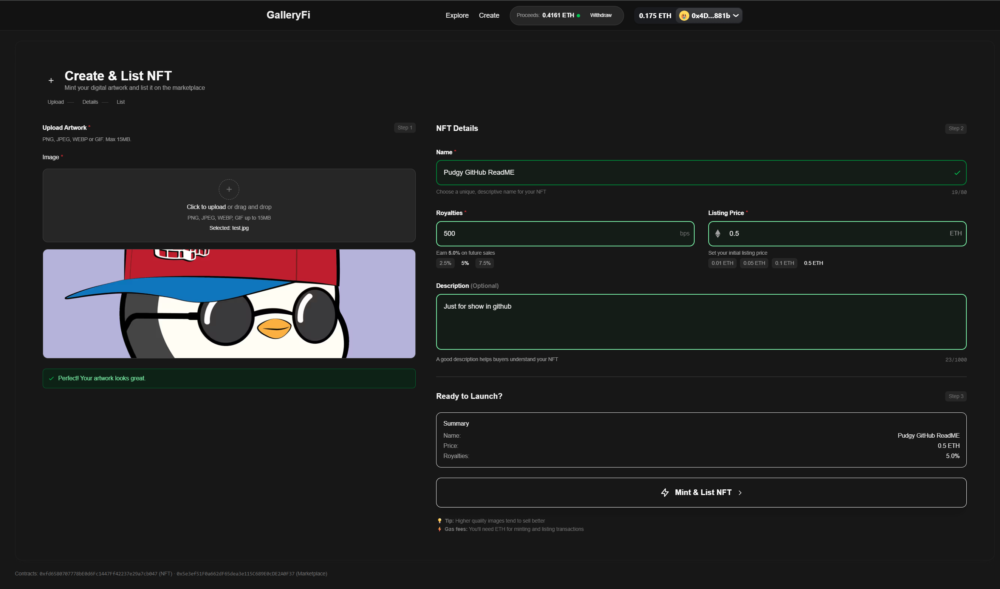
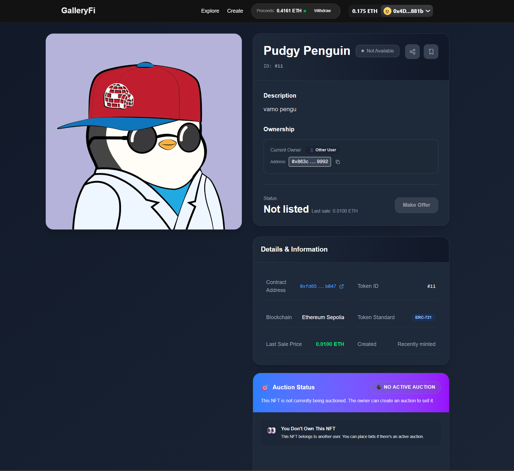
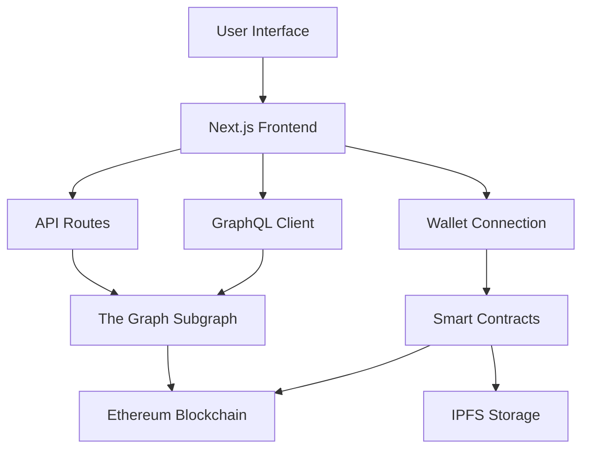

# GalleryFi - Professional NFT Marketplace

> A premium, curated NFT marketplace built with Next.js 15, Solidity 0.8.28, and The Graph Protocol. Quality over quantity with an exclusive business model.


## Screenshots

<div align="center">

### Explore Marketplace


### Create NFT


### NFT Detail Page


</div>

### NFT Detail Page


</div>

## What is GalleryFi?

**GalleryFi** is a curated NFT marketplace - think of it as a high-end art gallery for digital art, but on the blockchain. Unlike open marketplaces where anyone can list anything, GalleryFi focuses on quality and exclusivity.

### What makes it different?
- **Quality Control**: Only authorized artists can create NFTs
- **Curated Experience**: Every digital artwork goes through a selection process
- **Fair Revenue Model**: Platform fees + automatic royalties for artists
- **Enterprise Security**: Bank-level security patterns protect investments
- **Performance**: Smart filtering and pagination for smooth browsing

### For non-technical people:
> Imagine a digital art gallery where you can buy, sell, and auction unique digital artworks (NFTs). Each artwork is verified as authentic and one-of-a-kind, stored securely on the blockchain. Artists earn money every time their work is resold, and the platform ensures fair, transparent transactions.

---

## Key Features

### Marketplace Functionality
- **Fixed Price Sales**: Buy art instantly at a set price
- **Auction System**: Bid on artworks with real-time updates
- **Automatic Royalties**: Artists earn forever when their work resells (EIP-2981 standard)
- **Secure Escrow**: Platform safely holds payments until transactions complete
- **Safe Withdrawals**: Pull payment system prevents common hacking attempts

### User Experience
- **Mobile-Friendly Design**: Works perfectly on phones, tablets, and computers
- **Live Auction Timers**: See countdown timers update in real-time
- **Smart Filtering**: View all NFTs or just those available for purchase
- **Fast Loading**: Server-side optimization keeps everything responsive
- **Favorites System**: Save and track NFTs you love
- **Clear Ownership Info**: Always know who owns vs. who's selling an NFT

### Security & Standards
- **Industry Standard**: Full ERC-721 NFT compatibility (works with all wallets)
- **Hack Protection**: ReentrancyGuard prevents the most common attack vectors
- **Emergency Controls**: Admin can pause system if needed for security
- **Safe Payments**: Pull payment pattern eliminates payment-related exploits
- **Thoroughly Tested**: Comprehensive test suite covers edge cases and security scenarios

---

## System Architecture

```
GalleryFi/
├── 📁 packages/
│   ├── 📁 contracts/              # Smart Contracts (Blockchain Logic)
│   │   ├── 📁 contracts/
│   │   │   ├── 📄 MyNFT.sol              # ERC-721 contract with royalties
│   │   │   └── 📄 NftMarketPlace.sol     # Core marketplace logic
│   │   ├── 📁 deploy/             # Automated deployment scripts
│   │   ├── 📁 test/               # Unit and integration tests
│   │   └── 📁 typechain/          # Generated TypeScript types
│   │
│   ├── 📁 frontend/               # Frontend App (Next.js 15 + TypeScript)
│   │   ├── 📁 app/                # App Router (Next.js 14+)
│   │   │   ├── 📁 api/            # Server-side API routes
│   │   │   ├── 📁 explore/        # Main marketplace page
│   │   │   ├── 📁 create/         # NFT creation page
│   │   │   └── 📁 nft/[nft]/      # Dynamic NFT detail pages
│   │   ├── 📁 components/         # Reusable UI components
│   │   │   ├── 📁 layout/         # Layout components
│   │   │   ├── 📁 shared/         # Shared components
│   │   │   └── 📁 ui/             # Base UI components
│   │   ├── 📁 hooks/              # Custom React hooks
│   │   ├── 📁 lib/                # Utilities and services
│   │   │   ├── 📁 services/       # API services
│   │   │   ├── 📁 types/          # Type definitions
│   │   │   └── 📁 validations/    # Validation schemas
│   │   └── 📁 config/             # App configuration
│   │
│   └── 📁 subgraph/               # Blockchain Data Indexing
│       ├── 📁 mappings/           # Smart contract event handlers
│       ├── 📁 abis/               # Contract ABIs
│       ├── 📄 schema.graphql      # GraphQL data schema
│       └── 📄 subgraph.yaml       # Subgraph configuration
│
├── 📄 README.md                   # This file
└── 📄 package.json                # Workspace configuration
```

### How Data Flows Through the System



**How it works:**
1. **User Interface**: You click "Buy NFT" or place a bid
2. **Wallet Connection**: Your crypto wallet (like MetaMask) confirms the transaction
3. **Smart Contracts**: The blockchain verifies and executes the purchase/bid
4. **Data Indexing**: The Graph indexes all blockchain events for fast querying
5. **Frontend Updates**: The UI immediately shows your new NFT or updated bid status

---

## Technology Stack

### Smart Contracts & Blockchain
- **Solidity 0.8.28** - Latest version with enhanced security features
- **Hardhat** - Development framework with hot reload and testing
- **OpenZeppelin** - Battle-tested contract libraries (industry standard)
- **Hardhat Deploy** - Deterministic and upgradeable deployments
- **Typechain** - Automatic TypeScript type generation from contracts
- **Ethers.js v6** - Blockchain interaction library

### Frontend & User Interface
- **Next.js 15** - React framework with App Router and server-side rendering
- **React 19** - UI library with latest concurrent features
- **TypeScript** - Complete type safety throughout the application
- **Tailwind CSS** - Utility-first CSS framework for rapid styling
- **Headless UI** - Accessible components without opinionated styling

### Web3 Integration
- **Wagmi v2** - React hooks for Ethereum blockchain interaction
- **Viem** - TypeScript-first Ethereum client (modern alternative to ethers)
- **RainbowKit** - Premium wallet connection experience
- **WalletConnect** - Support for mobile wallets and cross-platform connections

### Data & APIs
- **The Graph Protocol** - Decentralized blockchain data indexing
- **GraphQL** - Efficient query language for APIs
- **Apollo Client** - GraphQL client with intelligent caching
- **React Query** - Server-side state management and caching

### Storage & Media
- **IPFS** - Decentralized storage for NFT metadata and images
- **Pinata** - IPFS gateway with global CDN for fast loading
- **Next.js Image** - Automatic image optimization and lazy loading

### Development & Testing
- **Jest** - JavaScript testing framework
- **React Testing Library** - Component testing utilities
- **Playwright** - End-to-end testing for real user scenarios
- **ESLint + Prettier** - Code linting and formatting
- **Husky** - Git hooks for code quality

---

## Smart Contract Details

### MyNFT.sol - Collection Contract
```solidity
// Key Features:
✅ ERC-721 compliant with URI storage
✅ EIP-2981 implementation for royalties
✅ Ownable access control
✅ 5% default royalties to creator
✅ Customizable royalties per token
✅ Configurable base URI
✅ Storage gap for upgradeability
```

**Key Functions:**
- `mint(address to, string uri)` - Owner-only minting
- `mintWithRoyalty()` - Minting with custom royalties
- `setDefaultRoyalty()` - Global royalty configuration

### NftMarketplace.sol - The Marketplace Engine
```solidity
// Key Features:
✅ Fixed-price listings
✅ English auction system
✅ 2.5% platform fee
✅ Automatic royalty distribution
✅ Pull payments pattern for security
✅ Emergency pause functionality
✅ NFT rescue capability for emergencies
```

**Core Functions:**
- `listItem()` - Create fixed-price listing
- `buyItem()` - Instant purchase
- `createAuction()` - Start auction
- `placeBid()` - Place bid
- `endAuction()` - End auction
- `withdrawProceeds()` - Withdraw earnings

---

## Project Setup

### Prerequisites
```bash
# Minimum required versions
node >= 18.0.0
npm >= 9.0.0
git >= 2.34.0

# Optional but recommended
yarn >= 1.22.0 (alternative to npm)
metamask (browser wallet extension)
```

### 1. Clone and Install
```bash
# Clone the repository
git clone https://github.com/EnricCoding/GalleryFi.git
cd GalleryFi

# Install all workspace dependencies
npm install

# Or if you prefer yarn
yarn install
```

### 2. Environment Configuration

#### Frontend (.env.local)
```bash
# Copy example file
cp packages/frontend/.env.example packages/frontend/.env.local

# Edit with your values:
NEXT_PUBLIC_SEPOLIA_RPC=https://eth-sepolia.g.alchemy.com/v2/YOUR_KEY
NEXT_PUBLIC_NFT_ADDRESS=0xYOUR_NFT_CONTRACT_ADDRESS
NEXT_PUBLIC_MARKET_ADDRESS=0xYOUR_MARKETPLACE_CONTRACT_ADDRESS
NEXT_PUBLIC_SUBGRAPH_URL=https://api.studio.thegraph.com/query/YOUR_SUBGRAPH
NEXT_PUBLIC_WC_PROJECT_ID=YOUR_WALLETCONNECT_PROJECT_ID
NEXT_PUBLIC_PINATA_GATEWAY=your-gateway.mypinata.cloud
NEXT_PUBLIC_CHAIN_ID=11155111

# For IPFS uploads
PINATA_JWT=your_pinata_jwt_token
PINATA_API_KEY=your_pinata_api_key
PINATA_API_SECRET=your_pinata_api_secret
```

#### Contracts (.env)
```bash
# Copy example file
cp packages/contracts/.env.example packages/contracts/.env

# Edit with your values:
PRIVATE_KEY=your_wallet_private_key_for_deployments
SEPOLIA_RPC=https://eth-sepolia.g.alchemy.com/v2/YOUR_KEY
ETHERSCAN_API_KEY=your_etherscan_api_key_for_verification
```

### 3. Required External Services

#### Alchemy (RPC Provider)
1. Sign up at [alchemy.com](https://alchemy.com)
2. Create new app for Ethereum Sepolia
3. Copy the API key URL

#### WalletConnect (Wallet Integration)
1. Sign up at [walletconnect.com](https://walletconnect.com)
2. Create new project
3. Copy the Project ID

#### Pinata (IPFS Gateway)
1. Sign up at [pinata.cloud](https://pinata.cloud)
2. Create API keys
3. Configure custom gateway

### 4. Smart Contract Deployment

```bash
# Navigate to contracts directory
cd packages/contracts

# Compile contracts
npm run compile

# Run tests (recommended before deployment)
npm run test

# Deploy to Sepolia testnet
npm run deploy:sepolia

# Verify contracts on Etherscan
npm run verify:sepolia
```

### 5. Subgraph Configuration and Deployment

```bash
# Navigate to subgraph directory
cd packages/subgraph

# Generate TypeScript code
npm run codegen

# Build the subgraph
npm run build

# Deploy to Graph Studio
npm run deploy
```

### 6. Start the Frontend

```bash
# Navigate to frontend directory
cd packages/frontend

# Start in development mode
npm run dev

# The application will be available at:
# http://localhost:3000
```

---

## Testing and Quality

### Smart Contract Testing
```bash
cd packages/contracts

# Run all tests
npm run test

# Tests with gas reporting
npm run gas

# Code coverage analysis
npm run coverage

# Specific test
npx hardhat test test/NftMarketplace.test.ts
```

# Sample test output
✓ NFT Contract Tests (15 tests passed)
✓ Marketplace Tests (23 tests passed)
✓ Integration Tests (8 tests passed)
```

### Frontend Testing
```bash
cd packages/frontend

# Unit tests
npm run test

# Tests in watch mode
npm run test:watch

# End-to-end integration tests
npm run test:e2e
```

### Code Quality and Formatting
```bash
# Code linting
npm run lint

# Automatic formatting
npm run format

# Automatic problem fixing
npm run lint:fix
```

---

## Production Deployment

### Frontend Deployment

#### Option 1: Vercel (Recommended)
```bash
# Install Vercel CLI
npm i -g vercel

# Login and deploy
vercel login
vercel --prod

# Or connect directly from GitHub
```

#### Option 2: Netlify
```bash
# Build for production
npm run build

# Static deploy to Netlify
# Connect repository from Netlify dashboard
```

### Mainnet Configuration

To use on Ethereum mainnet, update:

```bash
# In .env.local
NEXT_PUBLIC_CHAIN_ID=1
NEXT_PUBLIC_SEPOLIA_RPC=https://eth-mainnet.g.alchemy.com/v2/YOUR_KEY

# Re-deploy contracts to mainnet
npm run deploy:mainnet
```

---

## Business Model

### Business Architecture
```
Curated Marketplace
├── Only authorized creators can mint NFTs
├── Manual approval process for quality control
├── Focus on high-quality digital art
└── Premium and exclusive brand positioning

Revenue Streams
├── Platform commission: 2.5% on all transactions
├── Creator royalties: 5% on secondary sales
├── Premium services: Featured listings, analytics
└── Partnerships and special events
```

### Competitive Advantages
- **Exclusivity**: Curated model vs. open marketplaces (like OpenSea)
- **Quality**: Editorial control and manual curation
- **Security**: Enterprise-level security patterns
- **Performance**: Advanced server-side optimizations
- **Premium UX**: Superior user experience and design

---

## Security Implementation

### Smart Contract Security
- **ReentrancyGuard** on all transfer functions
- **Pull payment pattern** to prevent force attacks
- **Pausable contracts** for emergency situations
- **Access controls** with specific roles
- **Input validation** on all parameters
- **Gas optimizations** to prevent DoS attacks

### Frontend Security
- **Complete type safety** with TypeScript
- **Input sanitization** on all forms
- **CSRF protection** on API routes
- **Rate limiting** on critical endpoints
- **Error boundaries** for graceful error handling
- **Wallet security** with signature validations

### Infrastructure Security
- **Environment variables** for sensitive data
- **Automatic API key rotation**
- **HTTPS enforcement** in production
- **Content Security Policy** headers
- **Automatic dependency scanning**

## License

This project is licensed under the **MIT License**

## Author

**Enric** - *Full Stack Blockchain Developer*

- **GitHub**: [@EnricCoding](https://github.com/EnricCoding)
- **Email**: enricpaginasweb@gmail.com

---

<div align="center">

### If you find this project interesting, give it a star!

**[Live Demo](https://galleryfi.vercel.app)** | **[Report Bug](https://github.com/EnricCoding/GalleryFi/issues)**

</div>